# 松博教育网站：阿里云 ECS + 宝塔面板部署指南

本文记录 `songboai.cn` 本次实际完成的部署流程，并保留关键操作截图，后续可按同样步骤更新或重建网站。

## 1. 已完成的正式配置

| 项目 | 配置 |
| --- | --- |
| 域名 | `songboai.cn`、`www.songboai.cn` |
| 公网 IP | `116.62.55.62` |
| ECS 系统 | Alibaba Cloud Linux 3.2104 LTS 64 位 |
| 网站服务 | 宝塔面板 Nginx / HTML 项目 |
| 网站根目录 | `/www/wwwroot/songboai.cn` |
| 正式访问地址 | `https://songboai.cn` |
| `www` 访问规则 | `https://www.songboai.cn` 以 301 跳转到主域名 |
| SSL 证书 | Let's Encrypt，覆盖主域名与 `www` |
| 网站备案号 | `豫ICP备2026038031号-1` |
| 联系邮箱 | `songboai@189.cn` |

> 当前项目是 Astro 静态网站。生产服务器只由 Nginx 提供静态文件，不需要安装 Node.js、数据库、PHP、反向代理或 Node.js 项目运行环境。

---

## 2. 本地构建网站

### 2.1 环境要求

本机需使用 Node.js `22.12.0` 或更高版本：

```sh
node -v
```

### 2.2 首次安装与构建

在项目根目录执行：

```sh
npm install
npm run build
```

构建成功后，会生成 `dist/`。上传的是 `dist/` **内部的所有文件和目录**，不是整个项目，也不是外层 `dist/` 文件夹。

可选地执行以下命令预览构建后的站点：

```sh
npm run preview
```

### 2.3 上线前检查内容

品牌信息统一位于 `src/data/site.ts`。上线前核实其中的电话、邮箱、地址和备案号是否为真实值；修改后必须重新运行 `npm run build`。

当前“在线预约咨询”表单是静态界面，尚未接入数据库、邮件或第三方表单服务；访客填写的信息不会自动发送给工作人员。

---

## 3. 阿里云 ECS 网络要求

在 ECS 实例绑定的安全组 **入方向** 中，确认存在以下规则：

| 授权策略 | 协议 | 端口 | 授权对象 | 用途 |
| --- | --- | --- | --- | --- |
| 允许 | TCP | `80/80` | `0.0.0.0/0` | HTTP 访问与 SSL 文件验证 |
| 允许 | TCP | `443/443` | `0.0.0.0/0` | HTTPS 访问 |

若需要远程维护服务器，SSH 的 `22/22` 应尽量仅对自己的固定公网 IP 放行。宝塔面板端口也不应向全网开放。

此外，在宝塔左侧 **安全** 页面确认 `80`、`443` 已放行。阿里云安全组与宝塔安全规则都必须允许访问。

---

## 4. 配置云解析 DNS

在阿里云 **云解析 DNS** → `songboai.cn` → **解析设置** 中创建两条 A 记录：

| 记录类型 | 主机记录 | 记录值 | TTL | 状态 |
| --- | --- | --- | --- | --- |
| A | `@` | `116.62.55.62` | 10 分钟 | 启用 |
| A | `www` | `116.62.55.62` | 10 分钟 | 启用 |

“主机记录”只填写 `@` 或 `www`，不要填 `http://`、`https://`、完整域名、端口或 IP。

### 4.1 添加根域名记录

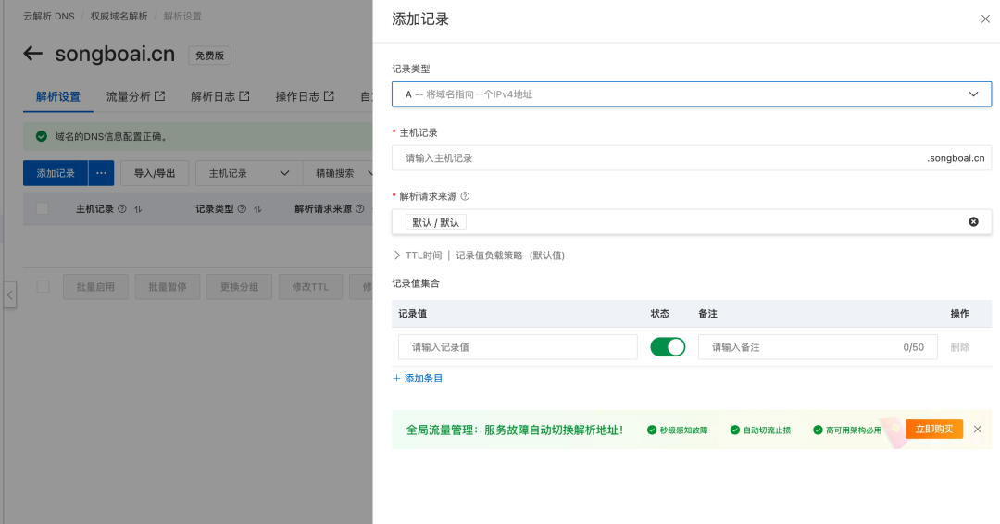

根域名确认信息如下，点击“确定”保存：

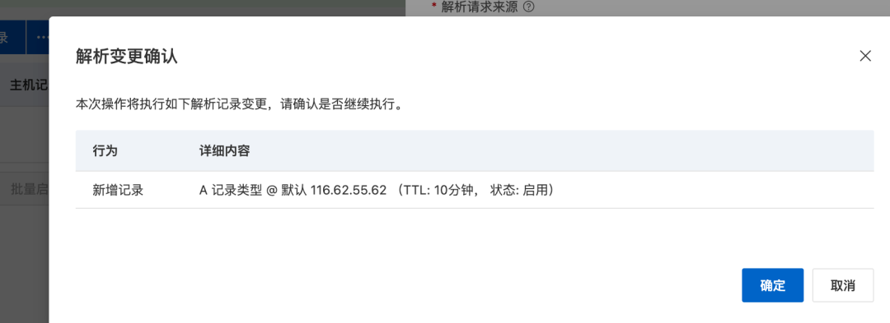

### 4.2 添加 `www` 记录

第二条记录使用主机记录 `www`，记录值同样为 `116.62.55.62`：

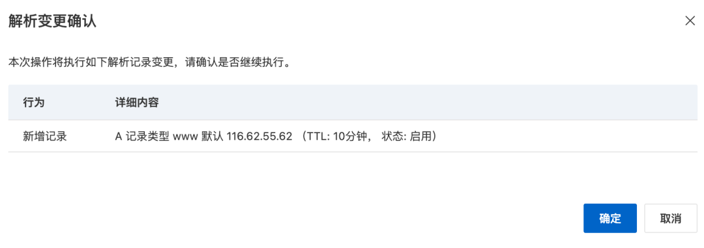

完成后列表应显示两条已启用记录：

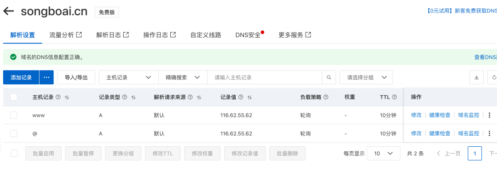

DNS 通常在数分钟内生效。可在本机检查：

```sh
nslookup songboai.cn
nslookup www.songboai.cn
```

两个结果均应指向 `116.62.55.62`。DNS 未生效前不要申请 SSL 证书。

---

## 5. 在宝塔创建 HTML 项目

1. 登录宝塔面板，进入左侧 **网站**。
2. 切换到顶部 **HTML项目** 标签。
3. 点击 **添加项目**。
4. 填写：

| 字段 | 填写内容 |
| --- | --- |
| 绑定域名 | `songboai.cn` 与 `www.songboai.cn`，每行一个 |
| 根目录 | `/www/wwwroot/songboai.cn` |
| FTP | 不创建 |
| 备注 | 可填写 `songboai.cn` 或“松博教育官网” |

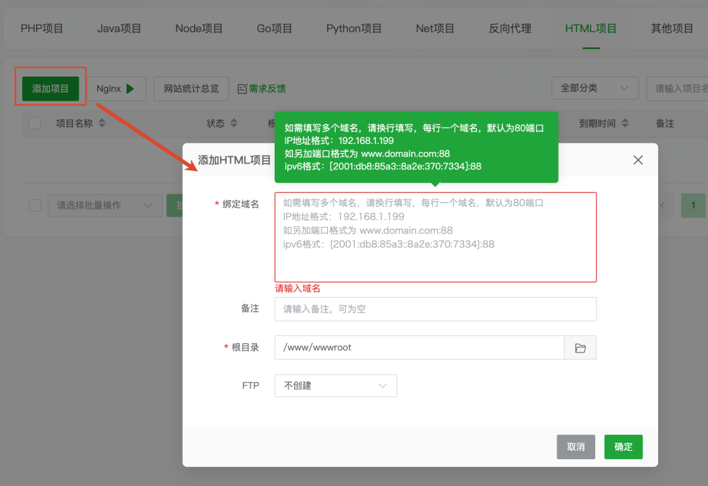

创建完成后，项目应显示为“运行中”，根目录为 `/www/wwwroot/songboai.cn`：

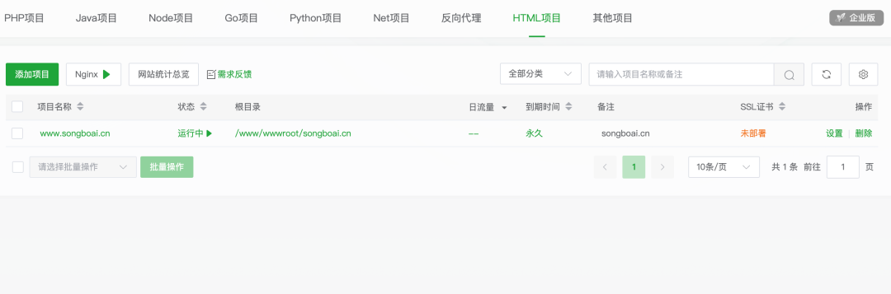

> 不创建数据库，不选择 PHP、Node.js 或反向代理项目。

---

## 6. 上传构建产物

### 6.1 清理默认首页

进入宝塔左侧 **文件**，打开：

```text
/www/wwwroot/songboai.cn
```

只删除宝塔自动生成的 `index.html`。保留 `404.html`、`.htaccess`、`.user.ini`。

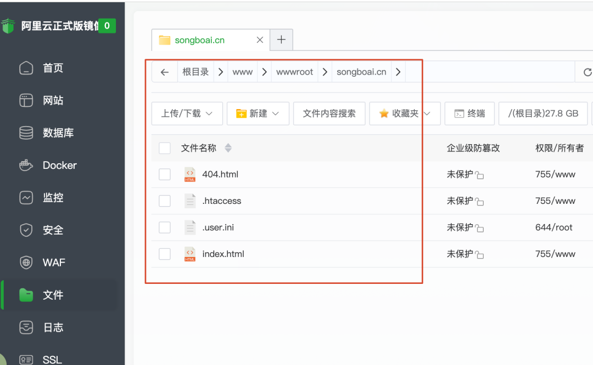

### 6.2 上传 `dist` 内部内容

在本机 Finder 打开项目的 `dist/`，选择其中全部内容并上传到 `/www/wwwroot/songboai.cn/`。

上传后，网站根目录第一层应直接包含：

```text
index.html
_astro/
about/
contact/
courses/
favicon.ico
favicon.svg
```

正确的上传结果如下：

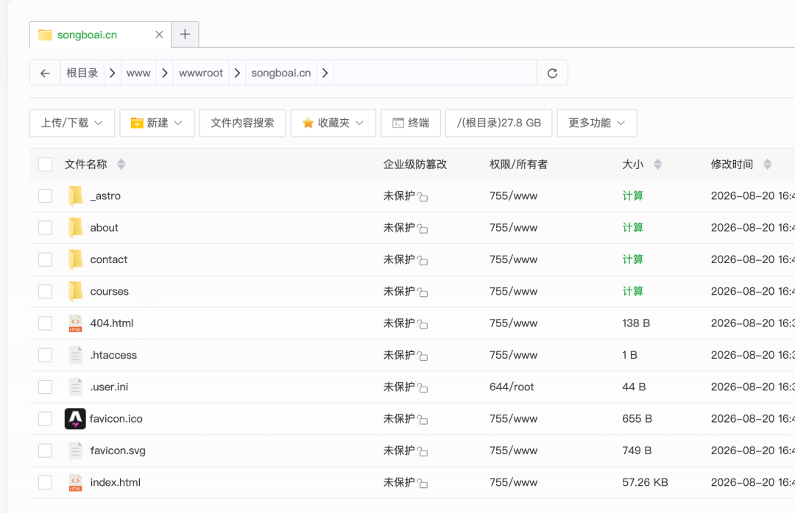

不要上传项目源码、`node_modules/` 或 `.git/`；也不要出现下列错误结构：

```text
/www/wwwroot/songboai.cn/dist/index.html
```

### 6.3 先验证 HTTP

上传完成后，在浏览器访问：

```text
http://songboai.cn
http://www.songboai.cn
```

页面可打开但浏览器显示“不安全”属于正常现象；这是 HTTP 未启用 TLS 的提示。确认两个 HTTP 地址都能打开后，再申请 SSL。

若无法打开，依次核对 DNS 解析、ECS/宝塔的 `80` 端口、Nginx 运行状态、项目绑定域名和网站根目录中的 `index.html`。

---

## 7. 申请、部署并强制使用 HTTPS

1. 进入 **网站** → 对应 HTML 项目右侧 **设置** → 左侧 **SSL**。
2. 打开 **免费证书**，点击“申请证书”。
3. 选择以下选项：

| 字段 | 选择 |
| --- | --- |
| 品牌 | Let's Encrypt |
| 验证方式 | 文件验证 |
| 域名 | 同时勾选 `songboai.cn`、`www.songboai.cn` |

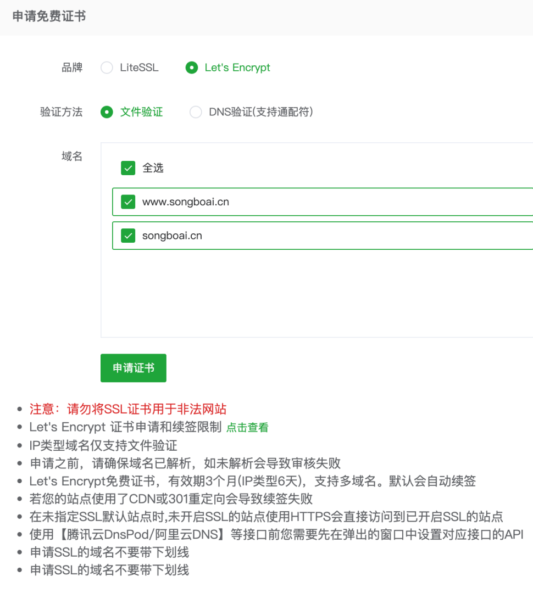

4. 点击“申请证书”，成功后将新证书部署到当前站点。
5. 在 **当前证书 - 已部署SSL** 页面开启“强制HTTPS”，并点击“保存”。

部署成功后，证书认证域名必须包含两个地址：

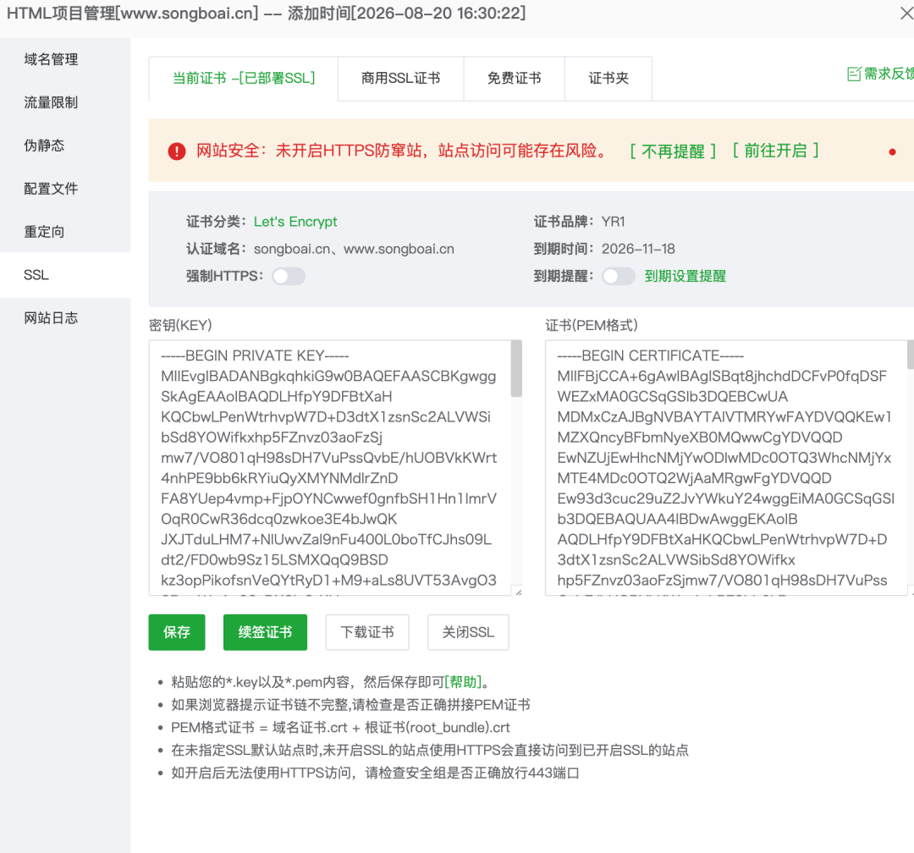

不要部署列表中仅显示 IP `116.62.55.62` 的历史证书；正确证书必须显示 `songboai.cn` 和 `www.songboai.cn`。

完成后验证：

```text
https://songboai.cn
https://www.songboai.cn
http://songboai.cn
```

前两个地址应能正常打开，第三个应自动跳转 HTTPS。若 HTTPS 无法访问，检查 ECS 安全组与宝塔安全页的 `443` 端口。

---

## 8. 将 `www` 301 跳转至主域名

为避免重复页面，并统一正式网址，在项目设置左侧进入 **重定向** → **添加重定向**，填写：

| 字段 | 内容 |
| --- | --- |
| 开启重定向 | 开启 |
| 保留 URI 参数 | 开启 |
| 重定向类型 | 域名 |
| 重定向方式 | `301（永久重定向）` |
| 重定向域名 | `www.songboai.cn` |
| 目标 URL | `https://songboai.cn` |

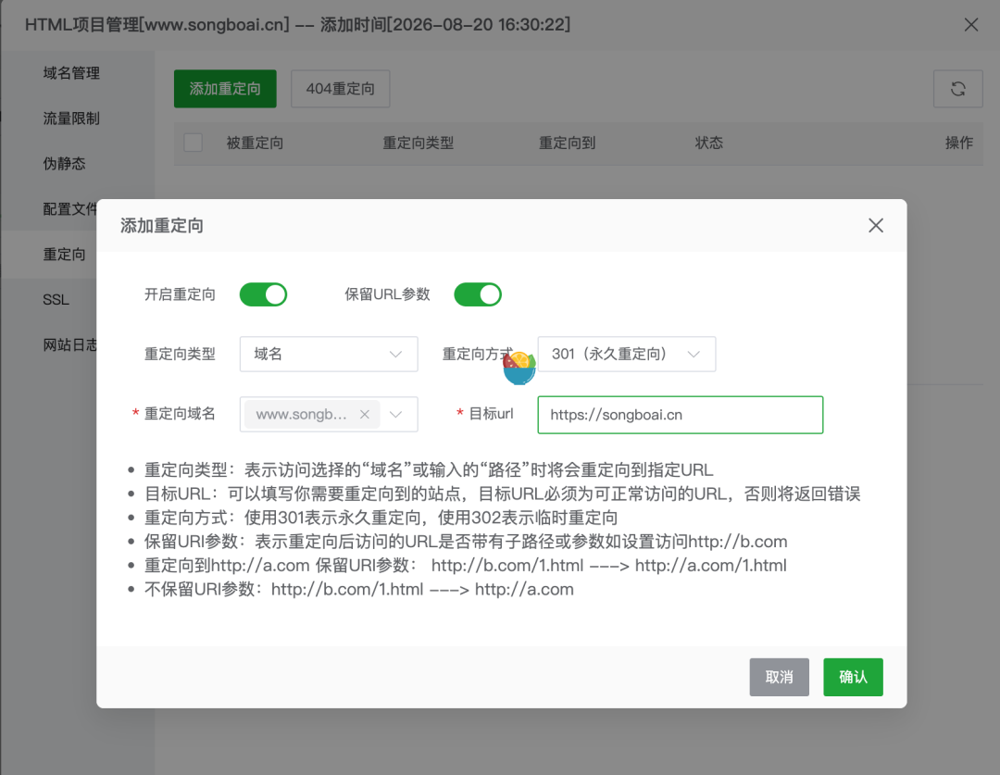

保存后，重定向列表会出现该规则：

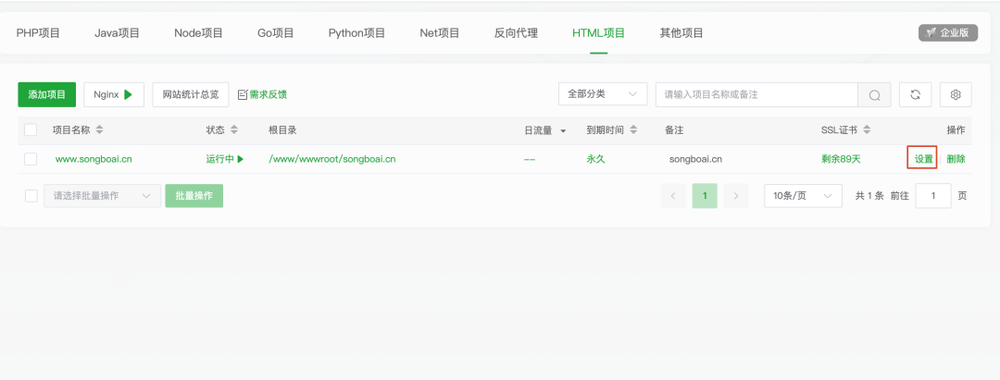

验证：

```text
https://www.songboai.cn
https://www.songboai.cn/about/
```

应分别跳转到：

```text
https://songboai.cn
https://songboai.cn/about/
```

保留 URI 参数后，内页路径和查询参数不会丢失。

---

## 9. 最终验收清单

使用电脑浏览器与手机流量分别检查：

- [ ] `https://songboai.cn` 可以打开首页。
- [ ] `http://songboai.cn` 自动跳到 HTTPS。
- [ ] `https://www.songboai.cn` 自动跳到 `https://songboai.cn`。
- [ ] `https://www.songboai.cn/about/` 跳到 `https://songboai.cn/about/`。
- [ ] 首页导航可打开课程中心、关于我们、联系我们。
- [ ] 刷新 `/courses/`、`/about/`、`/contact/` 不出现 404。
- [ ] favicon、样式与页面图片正常加载。
- [ ] 浏览器不显示“不安全”提示。
- [ ] 页脚显示 `豫ICP备2026038031号-1`，点击会在新标签打开工信部备案网站。
- [ ] 页脚邮箱显示 `songboai@189.cn`。
- [ ] 已知悉在线预约表单当前不会提交或保存访客信息。

---

## 10. 后续更新网站

每次改动页面、样式、备案信息或邮箱后：

1. 在本机项目根目录执行：

   ```sh
   npm run build
   ```

2. 宝塔进入 `/www/wwwroot/songboai.cn/`。
3. 推荐先将当前构建文件压缩为带日期的备份，并移到网站根目录外保存。
4. 上传新的 `dist/` 内部所有内容，覆盖旧构建文件。
5. 用无痕窗口访问 `https://songboai.cn`，或强制刷新，确认更新已生效。

仅替换静态构建文件通常不需要重启 Nginx。只有修改 SSL、域名、重定向或 Nginx 配置时，才需要在宝塔保存对应配置。

## 11. 安全注意事项

- 不要将宝塔面板管理端口对所有公网 IP 开放。
- 不要将项目源码、`node_modules/` 或 `.git/` 上传至站点根目录。
- 不要在 DNS 未解析到服务器前反复申请证书。
- 不要关闭 `80` 端口；Let's Encrypt 文件验证和 HTTP→HTTPS 跳转都可能需要它。
